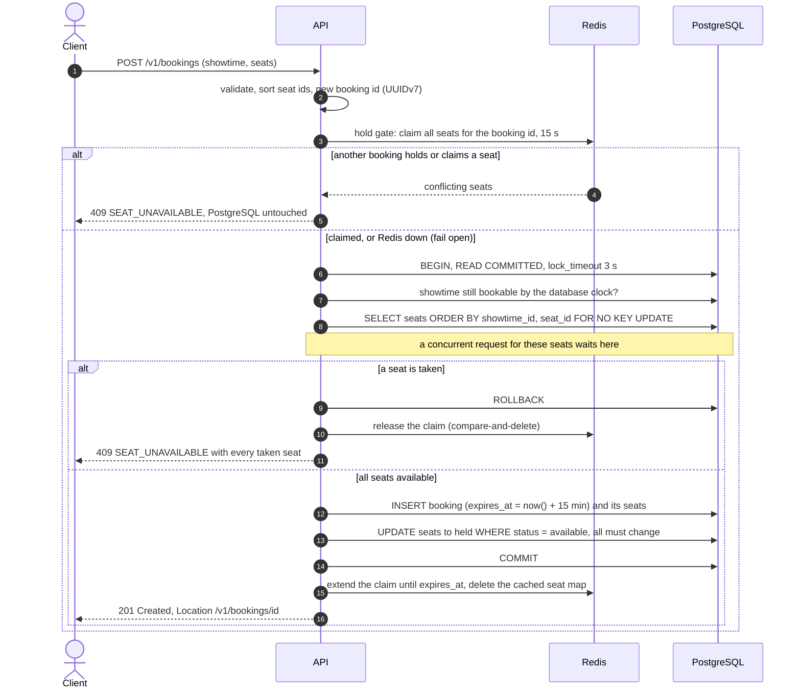
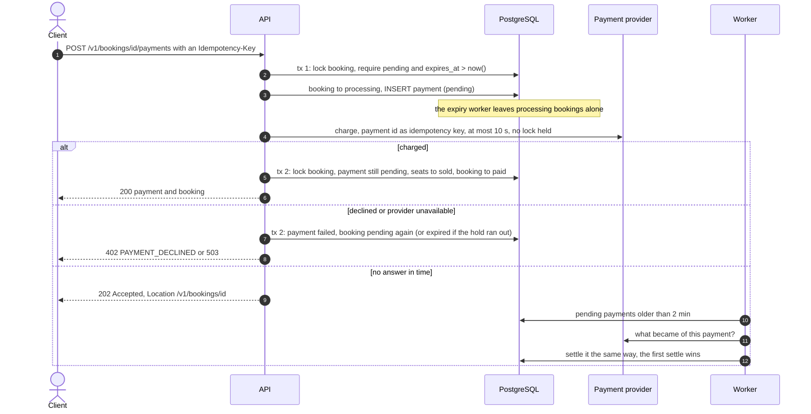
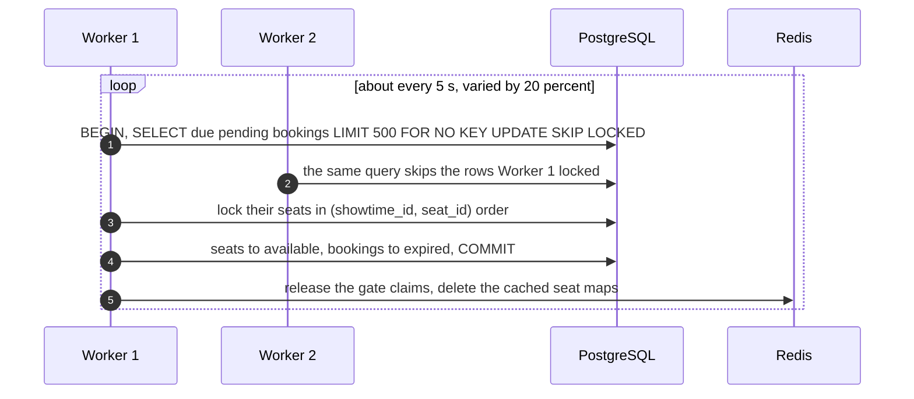

# Cinema Booking API

[](https://github.com/onetodone/cinema-api/actions/workflows/ci.yml)
[](https://onetodone.github.io/cinema-api/)

A REST API for cinema tickets, written in Go with PostgreSQL and Redis. Customers browse the schedule, hold seats
for 15 minutes, and pay for them. Unpaid holds expire on their own. **No seat is ever sold twice**, however many
people click "Book" at the same moment and however many API replicas serve them.

The project is small on purpose. It shows how to solve a handful of hard backend problems properly:

- **Concurrency.** Row locks taken in one global order, a compare-and-set on every seat, and schema constraints
  as a last line of defense. A 200-goroutine test and a 500-user k6 race both end with exactly one booking.
- **Transactions.** Short transactions, no network call while a lock is held, deadlock retries as a safety net,
  and a three-step payment that stays consistent when the provider answers late or never.
- **Caching.** Redis as a fail-open accelerator: a hold gate that turns losers away in about 0.1 ms, cached seat
  maps that are cleared on every change, idempotency records, and rate limits. With Redis down, everything
  still works and stays correct, only slower.
- **Background processing.** A worker expires unpaid bookings, settles stuck payments, and sweeps expired
  sessions. Any number of them can run next to each other, thanks to `SKIP LOCKED`.
- **Sessions.** Browser-grade login: a short-lived access token, and a refresh token in an `HttpOnly` cookie that
  rotates on every use. Twenty tabs refreshing at once through two API replicas all keep their session, and a
  stolen token that is used after its owner has moved on revokes the session.

Contents: [Quick start](#quick-start) · [How double-selling is prevented](#how-double-selling-is-prevented) ·
[Flows](#flows) · [Redis](#redis-an-accelerator-never-the-source-of-truth) ·
[Background worker](#background-worker) · [Sessions](#sessions-and-refresh-tokens) · [API](#api) · [Configuration](#configuration) ·
[Observability](#observability) · [Testing](#testing) · [Project layout](#project-layout) ·
[Trade-offs](#trade-offs-and-limitations)

## Quick start

You need Go 1.27, Docker, and `make`. [k6](https://k6.io) is optional; `make load-test` falls back to its
Docker image.

```sh
# 1. PostgreSQL 18 and Redis 8. Any instances will do; these match the defaults in .env.example.
docker run -d --name local-postgres -e POSTGRES_PASSWORD=root -p 5432:5432 postgres:18.4-alpine
docker run -d --name local-redis -p 6379:6379 redis:8.8-alpine

# 2. Configuration. The Makefile reads .env and exports it to every target. .env.example holds the production
#    defaults; the walk-through below also needs the test payment provider and a refresh cookie that plain HTTP
#    may carry.
cp .env.example .env            # its JWT_SECRET is a local placeholder; anywhere shared: openssl rand -base64 48
sed -i 's/^PAYMENT_LOCAL_ENABLED=.*/PAYMENT_LOCAL_ENABLED=true/; s/^AUTH_COOKIE_SECURE=.*/AUTH_COOKIE_SECURE=false/' .env

# 3. Database: create it, apply the migrations, and seed demo data (6 movies, 3 halls, a week of showtimes,
#    and the admin account from ADMIN_EMAIL / ADMIN_PASSWORD).
make db-create migrate-up seed

# 4. Run the API (:8080) and, in a second terminal, the worker.
make run-api
make run-worker
```

`make help` lists every target. `curl localhost:8080/readyz` answers `{"status":"ok",...}` once the API is up.

### Try it

The walk-through uses `jq`, and the `.env` of step 2: the local test payment provider is on (its tokens are
listed under [Payments](#payments)), and the refresh cookie is not `Secure`, so that curl sends it over plain HTTP.

```sh
API=localhost:8080
curl -s -X POST $API/v1/auth/register -H 'Content-Type: application/json' \
  -d '{"email":"ann@example.com","password":"correct horse"}'
# Log in: the access token is in the body, the refresh token in the cookie jar
TOKEN=$(curl -s -c jar -X POST $API/v1/auth/login -H 'Content-Type: application/json' \
  -d '{"email":"ann@example.com","password":"correct horse"}' | jq -r .access_token)

# Tomorrow's schedule, and the seat map of its first showtime
ST=$(curl -s "$API/v1/showtimes?date=$(date -u -d tomorrow +%F)" | jq '.items[0].id')
curl -s $API/v1/showtimes/$ST/seats | jq '{summary, first: .seats[0]}'

# Hold two seats for 15 minutes, then pay for them
SEATS=$(curl -s $API/v1/showtimes/$ST/seats | jq -c '[.seats[] | select(.status == "available") | .id][:2]')
BOOKING=$(curl -s -X POST $API/v1/bookings -H "Authorization: Bearer $TOKEN" -H 'Content-Type: application/json' \
  -d "{\"showtime_id\":$ST,\"seat_ids\":$SEATS}" | jq -r .id)
curl -s -X POST $API/v1/bookings/$BOOKING/payments -H "Authorization: Bearer $TOKEN" \
  -H 'Content-Type: application/json' -H "Idempotency-Key: pay-$BOOKING-1" \
  -d '{"payment_method":"local","payment_token":"tok_success"}' | jq '{payment: .payment.status, booking: .booking.status}'
```

Book again without paying: after `BOOKING_HOLD_TTL` (`make run-api BOOKING_HOLD_TTL=30s` for a demo) the worker
expires the booking, and the seats show `available` again.

The access token lasts 15 minutes. Refresh it with the cookie, which rotates on every refresh, and log out:

```sh
cp jar jar.old
TOKEN=$(curl -s -b jar -c jar -X POST $API/v1/auth/refresh -H 'Content-Type: application/json' -d '{}' \
  | jq -r .access_token)
# The previous cookie still gets the current token for 30 seconds (tabs that refreshed at once)...
curl -s -b jar.old -X POST $API/v1/auth/refresh -H 'Content-Type: application/json' -d '{}' | jq .user.email
# ...after that it revokes the session: 401 REFRESH_INVALID, and the current cookie stops working too
sleep 31; curl -s -b jar.old -X POST $API/v1/auth/refresh -H 'Content-Type: application/json' -d '{}' | jq .code
# Log in again, and out: 204, the session is gone and the cookie deleted
curl -s -c jar -o /dev/null -X POST $API/v1/auth/login -H 'Content-Type: application/json' \
  -d '{"email":"ann@example.com","password":"correct horse"}'
curl -s -b jar -c jar -o /dev/null -w '%{http_code}\n' -X POST $API/v1/auth/logout -H 'Content-Type: application/json' -d '{}'
```

### Run the Docker image

One image ships all four binaries (`/app/api` is the entrypoint; `/app/worker`, `/app/migrate`, and `/app/seed`
are selected with `--entrypoint`). It needs a PostgreSQL 18 and a Redis 8 it can reach:

```sh
make docker-build                                   # cinema-api:dev, distroless, runs as non-root
docker run --rm --network host --env-file .env --entrypoint /app/migrate cinema-api:dev up
docker run --rm --network host --env-file .env --entrypoint /app/seed cinema-api:dev
docker run -d --name cinema-api --network host --env-file .env cinema-api:dev
docker run -d --name cinema-worker --network host --env-file .env --entrypoint /app/worker cinema-api:dev
```

## How double-selling is prevented

**The invariant:** a seat of a showtime changes state only inside a transaction that holds its row lock, and the
only way into `held` is from `available`. PostgreSQL alone enforces it; Redis never decides who gets a seat.

**1. Every seat of every showtime is a row.** Scheduling a showtime inserts one `showtime_seats` row per seat of
the hall, in the same transaction. `SELECT … FOR UPDATE` can only lock rows that exist; locking "the absence of a
booking" is the phantom problem. A concrete inventory row makes pessimistic locking possible, and the seat map
one indexed query.

**2. The booking transaction locks the requested seats, then checks them.**

```sql
SELECT ss.seat_id, ss.status, …
FROM showtime_seats ss JOIN hall_seats hs ON hs.id = ss.seat_id
WHERE ss.showtime_id = $1 AND ss.seat_id = ANY($2)
ORDER BY ss.showtime_id, ss.seat_id
FOR NO KEY UPDATE OF ss;
```

When two users want seat A-7 at the same moment:

1. Both transactions reach the `SELECT`. The first gets the row lock; the second **waits** for it. A plain
   `SELECT` would not wait, and both would have seen `available`.
2. The first inserts the booking, marks the seat `held`, and commits.
3. The second wakes up. At READ COMMITTED, PostgreSQL re-reads the latest committed version of the locked row
   (EvalPlanQual), so it sees `held`, rolls back, and answers `409 SEAT_UNAVAILABLE`.
4. Had the first rolled back instead, the second would have seen `available` and succeeded. No false rejections.

`FOR NO KEY UPDATE` is the lock the following `UPDATE` takes anyway; unlike `FOR UPDATE`, it does not block the
foreign key checks of rows that reference the seat. The lock wait is bounded by `lock_timeout` (3 s, then
`409 SEAT_BUSY` with `Retry-After`).

**3. The write repeats the check.** `UPDATE showtime_seats SET status = 'held', booking_id = $bid WHERE … AND
status = 'available'` is an atomic compare-and-set, and the transaction rolls back unless it changed every
requested seat. Even a bug in step 2 could not sell a seat twice.

**4. The schema is the last line of defense.** `CHECK ((status = 'available') = (booking_id IS NULL))` ties a seat
to its holder; a partial unique index allows one unpaid booking per user and showtime, another one pending
payment per booking, and a third one successful payment per booking.

**5. One global lock order prevents deadlocks.** Alice books seats {5, 6} while Bob books {6, 5}: without an
order, each could lock one seat and wait for the other forever. Every code path (book, pay, cancel, expire) locks
the `bookings` row first, then seats sorted by `(showtime_id, seat_id)`, through one repository query. Deadlock
(`40P01`) and serialization (`40001`) errors are still retried, up to 4 attempts with jittered backoff, and
counted in `cinema_db_tx_retries_total`, which the tests keep at 0. A mutation test proved the point: locking in
`ORDER BY random()` made the overlapping multi-seat test retry 286 deadlocks and still fail with 967 more in 30 s.

**6. A payment never outlives its hold.** Payment runs in three steps, so no lock is held while the provider
works (see [the payment flow](#payment)). The first step moves the booking to `processing` only if `expires_at >
now()` by the database clock; the expiry worker never touches `processing` bookings. A charge that completes after
the deadline therefore still finds its seats, and an expired hold can never be paid. One clock decides every
deadline: PostgreSQL's `now()`.

**Why not the alternatives?**

| Approach | Why not |
|---|---|
| `SERIALIZABLE` | Also correct, but a hot seat makes most transactions abort with `40001`, and every one needs a retry loop. Row locks give predictable waits and precise errors (which seats are taken). |
| Optimistic `version` columns | Good under low contention. The middle seats of a premiere are the opposite: retry storms. |
| Advisory locks | Invisible in the schema, keyed by hashes, and unrelated to the rows they protect. |
| Redis locks only | Redis can lose data (failover, eviction, flush). It would make correctness depend on an accelerator. |

**Proof.** The integration tests run against real PostgreSQL 18 and Redis 8 containers (testcontainers):

- 200 goroutines book one seat: exactly 1 booking and 199 `SEAT_UNAVAILABLE`, in three modes (PostgreSQL only,
  with the Redis hold gate, and with Redis at a dead address).
- 40 users make 1 000 overlapping multi-seat bookings in random seat order, canceling between rounds: no deadlock,
  no retry, no seat held twice, and the gate's claims match the inventory afterwards.
- 200 owners pay within ±60 ms of their deadline while 4 workers expire bookings every 20 ms: every booking ends
  paid (seats sold, one successful payment) or expired (seats released, no payment).
- 20 admins schedule overlapping showtimes in one hall at once: exactly one succeeds; the exclusion constraint
  `EXCLUDE USING gist (hall_id WITH =, tstzrange(starts_at, ends_at) WITH &&)` rejects the rest.

The k6 script sends 500 users at one seat over HTTP: exactly **1×201 and 499×409**, no 5xx. On the development
machine the median booking took 35 ms with the hold gate (all 499 losers turned away by Redis) and 164 ms with
Redis down (all 500 requests decided by PostgreSQL). CI runs the same race against the Docker image on every push
to `main` and every pull request.

## Flows

### Booking



The booking id is created before the transaction, so it is the token of the Redis claim, and a retried
transaction reuses it. Every Redis step may fail without changing the outcome.

### Payment



If the provider charges after the worker has already settled the payment as failed, the API refunds the charge
and answers `409 PAYMENT_REFUNDED` (a compensation). Steps 2 and 3 ignore a client that hangs up: once money may
move, the outcome is recorded.

### Expiry



## Redis: an accelerator, never the source of truth

| Job | How | If Redis is down |
|---|---|---|
| **Hold gate** | Lua script claims all requested seats at once (`<prefix>:hold:{<showtime>}:<seat>` = booking id), extended to the hold's deadline after commit, released by compare-and-delete | Every request goes to PostgreSQL, which still decides correctly |
| **Seat map cache** | JSON per showtime, 5 s TTL, deleted after every committed seat change; concurrent misses share one query (`singleflight`) | Read from PostgreSQL |
| **Schedule cache** | JSON per local day, 10 s TTL, deleted when an admin adds a showtime to the day | Read from PostgreSQL |
| **Idempotency** | `Idempotency-Key` records (hash of owner and response), 24 h, claimed atomically by Lua | The partial unique indexes still prevent a duplicate booking or charge |
| **Rate limits** | Fixed one-minute windows (`INCR` + `PEXPIRE … NX` in one script) | Requests pass |

The gate is what keeps a premiere rush from filling the connection pool with transactions that queue on one
row lock: in the 200-goroutine test, the gate turns 199 losers away before they take a connection, and the race
takes 76 ms instead of 199 ms. The `{showtime}` hash tag keeps all claims of a showtime in one Redis Cluster
slot, which the multi-key script needs. The Redis client fails fast (one dial attempt, one retry, 500 ms
timeouts), so an outage costs about 20 ms per request, not seconds, and every failure is counted in
`cinema_redis_fail_open_total{op}`.

## Background worker

`cmd/worker` runs three jobs side by side:

- **Expirer.** Every `EXPIRER_INTERVAL` (5 s ± 20%) it expires due bookings in batches of up to 500, one
  transaction per batch, as in the diagram above. `SKIP LOCKED` splits the work between replicas without a
  leader: 4 workers expire 1 000 bookings in 70–100 ms, each exactly once. A booking its owner is canceling at
  that moment is skipped and picked up later.
- **Reconciler.** Every `RECONCILER_INTERVAL` (30 s) it asks the provider about payments still pending after
  `PAYMENT_GRACE` (2 min), and settles them.
- **Session sweeper.** Every `SESSION_SWEEP_INTERVAL` (1 h) it deletes expired sessions in batches of 1 000
  (`FOR UPDATE SKIP LOCKED` again). An expired session cannot refresh whether or not it was swept, so the sweeper
  only keeps the table small.

Why poll the database instead of in-memory timers or Redis keyspace notifications? Timers die with the process
and only know their own replica's bookings. Keyspace notifications are at-most-once Pub/Sub: an event sent during
a reconnect is lost for good, and every subscriber gets every event. A polling worker survives restarts, scales
out with `SKIP LOCKED`, and costs one index range scan every 5 s. Correctness never depends on its timing:
payment checks the deadline itself, so a late worker only delays when seats return to sale.

On `SIGTERM` the batch in flight finishes and no new one starts.

## Sessions and refresh tokens

A login starts a server-side session, a row in `sessions`. The client gets two tokens:

- an **access token** (JWT, HS256, 15 minutes) for `Authorization: Bearer`. It names its session in a `sid` claim;
  a token without one is refused. A browser keeps it in memory only.
- a **refresh token** `<session id>.<secret>` (256 random bits) in the `cinema_refresh` cookie: `HttpOnly` (no
  script can read it), `SameSite=Strict`, `Path=/v1/auth` (no other request carries it), `Secure` unless
  `AUTH_COOKIE_SECURE=false`. Only the SHA-256 of the secret is stored.

`POST /v1/auth/refresh` trades the cookie for a new access token and **rotates** the refresh token. What happens
depends on which token the cookie holds, judged by the database clock:

| The presented token is | Within `REFRESH_GRACE` (30 s) of the last rotation | Later |
|---|---|---|
| the current one | the same token again, no second rotation | **rotate**: a new token, by compare-and-set on the old hash |
| the previous one | **the current token**: a tab that lost the race, or a client whose answer got lost | **reuse detected**: the session is revoked |
| older, unknown, malformed, or the session has expired | 401 `REFRESH_INVALID`, and the cookie is deleted | same |

Twenty tabs that refresh with one token at once therefore make exactly one rotation, and all of them end up with
the same current token; the integration test runs them through two API instances. The losers of the race need
the current token, but it exists only as a hash in the database. Keeping it in process memory would work with one
replica only, and Redis must never decide correctness. So each rotation also stores the new secret **sealed with
AES-256-GCM** under a per-session key derived by HKDF from `JWT_SECRET`, and only opens it within the grace window.

The trade: within those 30 seconds, whoever holds the previous token also gets the current one, the price of
tolerating concurrent tabs and lost answers. After them, presenting a used token can only mean a copy, and ends the
session for everybody who holds it.

Also:

- `POST /v1/auth/logout` ends the session of the cookie (current or previous token) and deletes the cookie. It
  needs no access token and always answers 204. `POST /v1/auth/logout-all` (bearer) ends every session of the user.
- Refresh and logout accept only a JSON body (`{}`), so a cross-site form cannot trigger them; `SameSite=Strict`
  and the absence of CORS close the rest.
- A session ends 7 days after its last refresh (`REFRESH_TOKEN_TTL`), and 30 days after its login at the latest
  (`SESSION_MAX_AGE`). A user has at most 20 sessions (`AUTH_MAX_SESSIONS_PER_USER`): a login locks the user's row
  and ends the least recently used ones, so even concurrent logins cannot overshoot the cap.
- Refreshes are limited per session (60 per minute), not per address, so users behind one NAT do not share a budget.
- `register` starts no session; clients log in after registering.

## API

The contract is [`api/openapi.yaml`](api/openapi.yaml) (OpenAPI 3.1, linted by `make lint-api`); a test checks that
it documents exactly the routes the router serves. Its rendered reference is published at
**<https://onetodone.github.io/cinema-api/>**: GitHub Pages serves [`docs/index.html`](docs/index.html), a static
Redoc page, from `main`. `make docs` renders it locally, and the Docs workflow renders and commits it on every change
to the contract on `main`, so it never has to be updated by hand.

| Route | Access | Purpose |
|---|---|---|
| `POST /v1/auth/register`, `POST /v1/auth/login` | public | Account; a session: access token (JWT, 15 min) and refresh cookie |
| `POST /v1/auth/refresh`, `POST /v1/auth/logout` | refresh cookie | New tokens, rotating the refresh token; end the session |
| `POST /v1/auth/logout-all` | user | End every session of the caller |
| `GET /v1/me` | user | The caller's account |
| `GET /v1/movies`, `GET /v1/movies/{movieID}` | public | Movies, a movie with its showtimes of the next 14 days |
| `GET /v1/showtimes?date=&movie_id=` | public | The schedule of a day in the cinema's time zone |
| `GET /v1/showtimes/{showtimeID}` · `/seats` | public | A showtime; its seat map with each seat's status and price |
| `POST /v1/bookings` · `GET /v1/bookings` | user | Hold 1–10 seats for 15 minutes; list own bookings |
| `GET` · `DELETE /v1/bookings/{bookingID}` | owner | Read; cancel (releases the seats) |
| `GET /v1/payment-methods` | public | The enabled payment providers |
| `POST /v1/bookings/{bookingID}/payments` | owner | Pay (`Idempotency-Key` required) |
| `POST /v1/admin/movies` · `halls` · `showtimes` | admin | Manage the catalog |
| `GET /healthz`, `GET /readyz` | public | Liveness; readiness (503 only without PostgreSQL) |

Errors are RFC 9457 problem details with a stable `code`, such as:

```json
{
  "type": "about:blank", "title": "Conflict", "status": 409,
  "detail": "seats 61, 62 are already held or sold", "instance": "/v1/bookings",
  "code": "SEAT_UNAVAILABLE", "request_id": "0199a1f0-7c1e-7d2a-9b3e-5f0c2d1e4a77",
  "unavailable_seat_ids": [61, 62]
}
```

Validation errors list every bad field at once in `errors`. Answers worth retrying unchanged (`SEAT_BUSY`,
`BOOKING_BUSY`, `IDEMPOTENCY_IN_PROGRESS`, 429, 503) carry `Retry-After`.

**Idempotency.** `POST /v1/bookings` accepts, and payments require, an `Idempotency-Key`. A retry with the same key
and body replays the first answer (`Idempotent-Replayed: true`) for 24 hours; the same key with another body is
`422 IDEMPOTENCY_KEY_REUSED`; a retry while the first request runs is `409 IDEMPOTENCY_IN_PROGRESS`. Answers that
invite a retry (5xx, anything with `Retry-After`) are not stored.

**Rate limits.** Per minute: 20 booking attempts per user, 30 logins and registrations per client address,
10 logins per account, and 60 refreshes per session. Behind a proxy, set `HTTP_TRUSTED_PROXIES` so the client address comes from
`X-Forwarded-For`.

### Payments

Payments go through a provider interface (Strategy/Adapter), `internal/payment.Provider`, with a registry that
switches providers on and off by configuration. Adding Stripe means an adapter that passes the shared contract
tests (`paymenttest.Run`), a config block, and one `Register` call; the booking flow does not change. The only
provider built so far is the **local test provider** (`PAYMENT_LOCAL_ENABLED=true`, never in production), which
takes these tokens:

| Token | Result |
|---|---|
| `tok_success` | 200, paid |
| `tok_slow` | paid after 5 s: start it just before the hold ends to see the payment win the race with the expiry |
| `tok_declined`, `tok_insufficient_funds`, `tok_expired_card` | 402 with that `decline_code`; the booking is pending again |
| `tok_unavailable` | 503, nothing charged |
| `tok_error`, `tok_timeout` | 202; the worker settles the payment after `PAYMENT_GRACE` |

## Configuration

All settings are environment variables, validated at startup (every problem is reported at once).
[`.env.example`](.env.example) lists all of them with explanations; the most important ones:

| Variable | Default | Meaning |
|---|---|---|
| `DATABASE_URL` | (required) | PostgreSQL 18 |
| `REDIS_ADDR` | `localhost:6379` | Redis 8; may be down |
| `JWT_SECRET` | (API only) | HS256 key, at least 32 bytes; also the root of the keys that seal refresh secrets |
| `JWT_TTL` | `15m` | Access token lifetime |
| `REFRESH_TOKEN_TTL` · `SESSION_MAX_AGE` | `168h` · `720h` | A session ends 7 days after its last refresh, 30 days after its login at the latest |
| `REFRESH_GRACE` | `30s` | How long the previous refresh token still gets the current one |
| `AUTH_COOKIE_SECURE` · `AUTH_COOKIE_PATH` | `true` · `/v1/auth` | The refresh cookie; `false` only for development over plain HTTP |
| `AUTH_MAX_SESSIONS_PER_USER` | `20` | A login beyond it ends the least recently used session |
| `HTTP_ADDR` · `METRICS_ADDR` · `WORKER_METRICS_ADDR` | `:8080` · `:9090` · `:9091` | Public API; internal metrics of the API; worker metrics and probes |
| `CINEMA_TIMEZONE` · `CINEMA_CURRENCY` | `UTC` · `USD` | Schedule days and response offsets; currency of all prices |
| `BOOKING_HOLD_TTL` · `BOOKING_MAX_SEATS` | `15m` · `10` | Hold length; seats per booking |
| `DB_LOCK_TIMEOUT` | `3s` | Longest wait for a row lock before `SEAT_BUSY` |
| `EXPIRER_INTERVAL` · `RECONCILER_INTERVAL` · `SESSION_SWEEP_INTERVAL` | `5s` · `30s` · `1h` | Worker cadence |
| `PAYMENT_TIMEOUT` · `PAYMENT_GRACE` | `10s` · `2m` | Provider call limit; age at which the worker settles a payment |
| `SEATMAP_CACHE_TTL` · `SCHEDULE_CACHE_TTL` | `5s` · `10s` | Cache lifetimes; `0` turns a cache off |
| `*_RATE_LIMIT_PER_MIN` | `20` / `30` / `10` / `60` | Booking, auth per address, login per account, refresh per session; `0` turns a limit off |
| `PAYMENT_LOCAL_ENABLED` | `false` | The local test provider |
| `ADMIN_EMAIL` · `ADMIN_PASSWORD` | `admin@cinema.local` · none | Admin account that `make seed` creates or resets |

## Observability

- **Logs:** JSON (`slog`), one access log line per request, every line with the `request_id` that the response
  also carries in `X-Request-ID`.
- **Metrics:** Prometheus, on internal ports only: the API on `METRICS_ADDR` (`:9090`), the worker on
  `WORKER_METRICS_ADDR` (`:9091`, next to its `/healthz` and `/readyz`). Every counter starts at 0.

| Metric | What it shows |
|---|---|
| `cinema_http_request_duration_seconds{route,code}` | Latency per route pattern |
| `cinema_booking_attempts_total{result}` | created, seat_unavailable, busy, active_booking_exists, rejected, failed |
| `cinema_hold_gate_rejections_total` | Booking requests Redis turned away before PostgreSQL |
| `cinema_db_tx_retries_total{sqlstate}` | Deadlock and serialization retries; should stay 0 |
| `cinema_bookings_expired_total` | Holds released by the worker |
| `cinema_payments_total{provider,result}` | succeeded, declined, provider_unavailable, pending, refunded |
| `cinema_payments_reconciled_total{result}` | Stuck payments the worker settled as paid or failed, or could not settle |
| `cinema_auth_refresh_total{result}` | rotated, reissued, grace, reuse_detected, expired, invalid |
| `cinema_sessions_swept_total` | Expired sessions deleted by the worker |
| `cinema_cache_requests_total{cache,result}` | Hits, misses, and errors of the seat map and schedule caches |
| `cinema_redis_fail_open_total{op}` | Redis failures the system carried on without |
| `cinema_rate_limit_rejections_total{limit}`, `cinema_idempotency_requests_total{result}` | Request guards |

## Testing

```sh
make check              # go vet, golangci-lint, unit tests with -race
make test-integration   # real PostgreSQL 18 and Redis 8 in throwaway containers (needs Docker), with -race
make lint-api           # the OpenAPI contract
make docs               # render the API reference docs/index.html
make load-test          # k6: 500 users race for one seat against a running API
```

- **Unit tests** cover the domain rules and every service over in-memory fakes, including the lock order of each
  use case. The worker loops run in `testing/synctest` bubbles, where minutes of jittered pauses pass in
  microseconds.
- **Integration tests** give each test its own database cloned from a migrated template and its own Redis key
  prefix, so they run in parallel. PostgreSQL runs with `deadlock_timeout=100ms`, so a broken lock order fails
  within seconds.
- **Mutation checks** were run by hand on the key guards (random lock order, no `SKIP LOCKED`, expiring
  `processing` bookings, ignoring the payment deadline, no cache invalidation, a rotation without its
  compare-and-set, a login without the user lock, no grace window): each made a test fail.
- **Load test.** Start the API without the per-address auth limit, since setup logs 500 accounts in from one
  address, and with a cheaper password hash:

  ```sh
  make run-api AUTH_IP_RATE_LIMIT_PER_MIN=0 BCRYPT_COST=10
  make load-test          # make load-test VUS=1000 for more contenders
  ```

  Settings go after the target: the Makefile reads `.env` as make variables, which override the shell
  environment but not the command line.

  It passes only with exactly one 201, `VUS-1` 409s, nothing else, and one winning booking found afterwards, which
  it then cancels. The accounts (`k6-race-<n>@load.test`) are reused by later runs.
- **CI** (GitHub Actions) runs lint, unit tests, integration tests, and an end-to-end job that builds the image,
  migrates and seeds a fresh database, starts the API and the worker, and runs the k6 race. A second workflow,
  Docs, keeps `docs/index.html` in step with the contract.

## Project layout

```
cmd/                    api, worker, migrate, seed: one binary each
internal/
  domain/               entities, state machines, validation, domain errors (no infrastructure imports)
  service/              use cases; each package declares the ports it needs
    booking/            create, cancel, expire, pay, settle, reconcile
    catalog/            movies, schedule, seat maps (cache-aside, singleflight)
    auth/  admin/
  repository/postgres/  pgx and hand-written SQL, unit of work, lock order, retries
  repository/redis/     hold gate, caches, idempotency, rate limits (Lua scripts embedded)
  payment/              provider contract and registry; local/ test provider; paymenttest/ contract tests
  transport/httpapi/    net/http router, middleware, handlers, problem details
  worker/               expirer, reconciler, and session sweeper loops
  platform/             infrastructure helpers: pgx pool, Redis client, logging, metrics, migrations
  config/               environment variables to a validated Config
  app/                  composition root
migrations/             goose SQL, embedded in the binaries
api/openapi.yaml        the contract
docs/index.html         its rendered reference (generated by make docs and the Docs workflow)
test/integration/       testcontainers tests, including the race tests
test/load/              the k6 script
```

The dependency rule: `transport → service → domain`. Repositories and payment providers implement interfaces that
the services declare, so services never import pgx, go-redis, or Prometheus, and they are tested with fakes.

## Trade-offs and limitations

- **The gate is final for its request.** A request for seats that another request has claimed but not yet
  committed gets `SEAT_UNAVAILABLE` at once, even if that other request then fails. PostgreSQL alone would have
  queued it. That is the point during a rush; the seat map shows the truth within milliseconds.
- **Staleness is bounded, not zero.** `seats_available` in the schedule may be 10 s old; the seat map is cleared on
  every change. Bookings always check PostgreSQL.
- **Expiry lags by up to one worker pause** (5 s ± 20%). Payment rejects an expired hold by itself, so the lag
  only delays when seats return to sale.
- **Ending a session does not stop its access tokens at once.** Logout, logout-all, and a detected reuse stop
  refreshes immediately, but access tokens are stateless JWTs and stay valid until they expire (`JWT_TTL`, 15 min).
- **The grace window is a window for thieves too.** Within 30 s of a rotation, the previous refresh token gets the
  current one; only one previous generation is remembered, so an older token is refused but revokes nothing.
- **Registration reveals whether an address exists** (`409 EMAIL_TAKEN`); the per-address limit slows enumeration.
- **A failed compensation refund needs manual work.** It is logged at error level with every id; a refund outbox
  would be the production answer.
- **One currency, one time zone, no showtime cancellation** by admins (out of scope). If cancellation is added,
  booking must lock the showtime row too.
